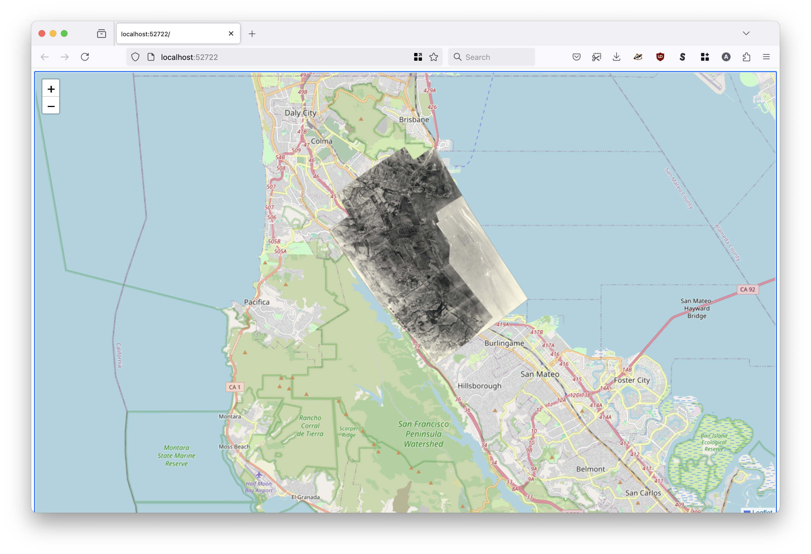
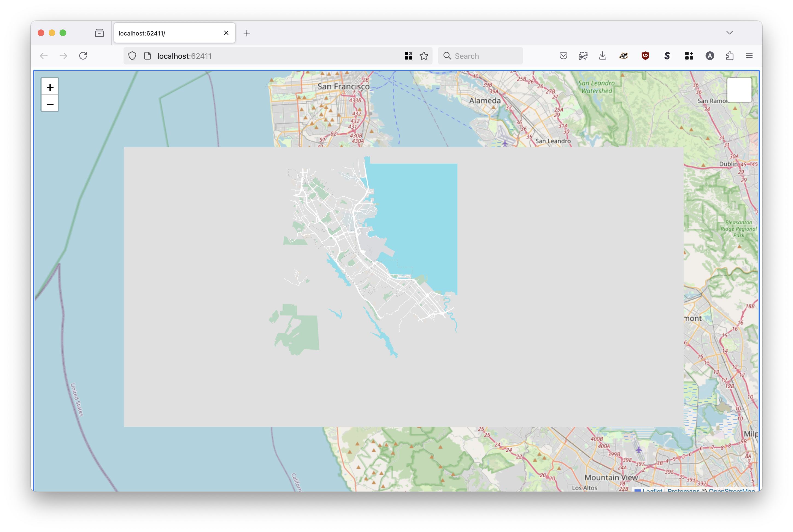

# go-pmtiles-show

Command-line tool for serving PMTiles databases from an on-demand web server.

## Motivation

It's basically a simpler and dumber version of [geojson.io](https://geojson.io/) but for [PMTiles databases](https://docs.protomaps.com/pmtiles/) that you can run locally from a single binary application.

Have a look at the [Small focused tools for visualizing geographic data](https://millsfield.sfomuseum.org/blog/2024/10/02/show/) blog post for more background.

## Documentation

Documentation (`godoc`) is incomplete at this time.

## Tools

```
$> make cli
go build -mod vendor -ldflags="-s -w" -o bin/show cmd/show/main.go
```

To enable use the [WebViewBrowser `Browser` implementation](https://github.com/sfomuseum/go-www-show?tab=readme-ov-file#webviewbrowser-webview) tools will need to be build with the `webview` tag set. For example:

```
$> go build -mod vendor -ldflags="-s -w" -tags webview -o bin/show cmd/show/main.go
```

### show

```
$> ./bin/show -h
Command-line tool for serving PMTiles tiles from an on-demand web server.
Usage:
	 ./bin/show [options]
Valid options are:
  -browser-uri string
    	A valid sfomuseum/go-www-show/v2.Browser URI. Valid options are: web:// (default "web://")
  -initial-view string
    	A comma-separated string indicating the map's initial view. Valid options are: 'LON,LAT', 'LON,LAT,ZOOM' or 'MINX,MINY,MAXX,MAXY'.
  -leaflet_point_style string
    	A custom Leaflet style definition for points. This may either be a JSON-encoded string or a path on disk.
  -leaflet_style string
    	A custom Leaflet style definition for geometries. This may either be a JSON-encoded string or a path on disk.
  -map-provider string
    	Valid options are: leaflet, protomaps (default "leaflet")
  -map-tile-uri string
    	A valid Leaflet tile layer URI. See documentation for special-case (interpolated tile) URIs. (default "https://tile.openstreetmap.org/{z}/{x}/{y}.png")
  -port int
    	The port number to listen for requests on (on localhost). If 0 then a random port number will be chosen.
  -protomaps-theme string
    	A valid Protomaps theme label (for the base map not individual PMTiles databases). (default "white")
  -raster value
    	Zero or more {LAYER_NAME}={PATH} pairs referencing PMTiles databases containing raster data.
  -vector value
    	Zero or more {LAYER_NAME}={PATH} pairs referencing PMTiles databases containing vector (MVT) data.
  -verbose
    	Enable verbose (debug) logging.
```	

#### Example (raster)

```
$> ./bin/show \
	-initial-view -122.408061,37.601617,-122.354907,37.640167 \
	-raster test=fixtures/1930-raster.pmtiles
	
2025/03/12 14:36:38 INFO Server is ready and features are viewable url=http://localhost:52722
```

Which, when you open `http://localhost:52722` in your web browser, would yield this:



#### Example (vector)

```
$> ./bin/show \
		-initial-view -122.408061,37.601617,-122.354907,37.640167 \
		-vector sfo=fixtures/sfo.pmtiles

2025/03/18 08:09:11 INFO Server is ready and features are viewable url=http://localhost:62411
```

Which, when you open `http://localhost:52722` in your web browser, would yield this:



As of this writing there is only a single default style for (PMTiles) vector layers. It is [a fork](https://github.com/sfomuseum/protomaps-leaflet) of the default `light` style which has been updated to have a transparent background for areas where there is no tile data. The determination of which areas are considered to have tile data, as seen in the screenshot above, is determined by Protomaps and changes depending on the zoom level.

## See also

* https://github.com/sfomuseum/go-www-show
* https://github.com/sfomuseum/protomaps-leaflet